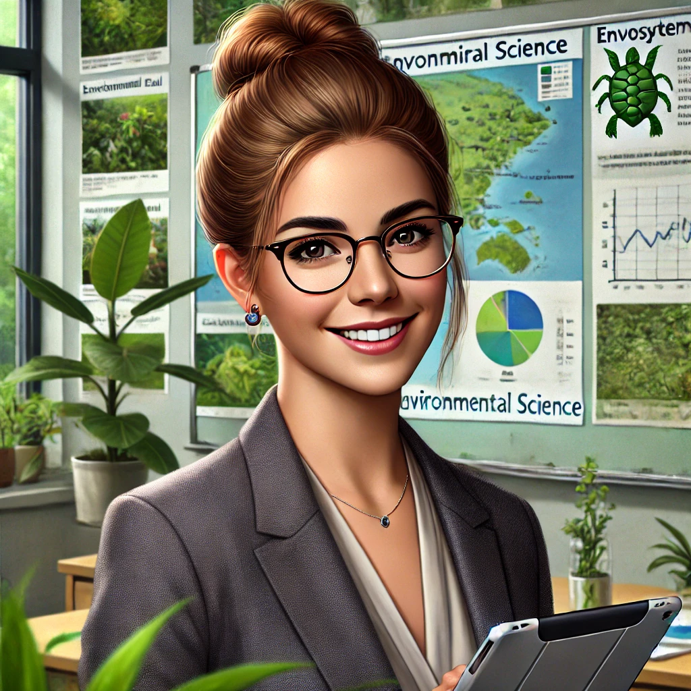
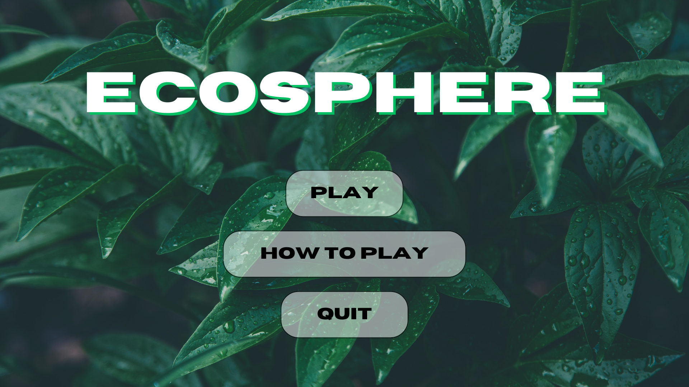
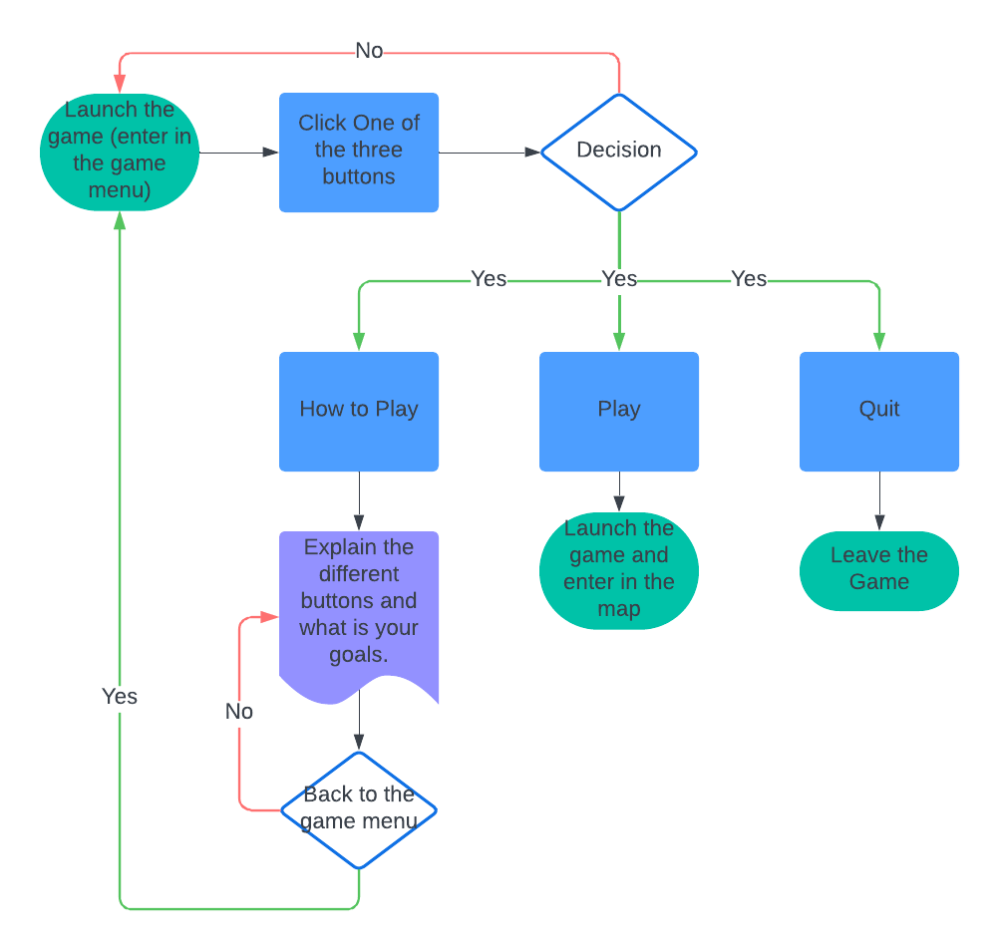
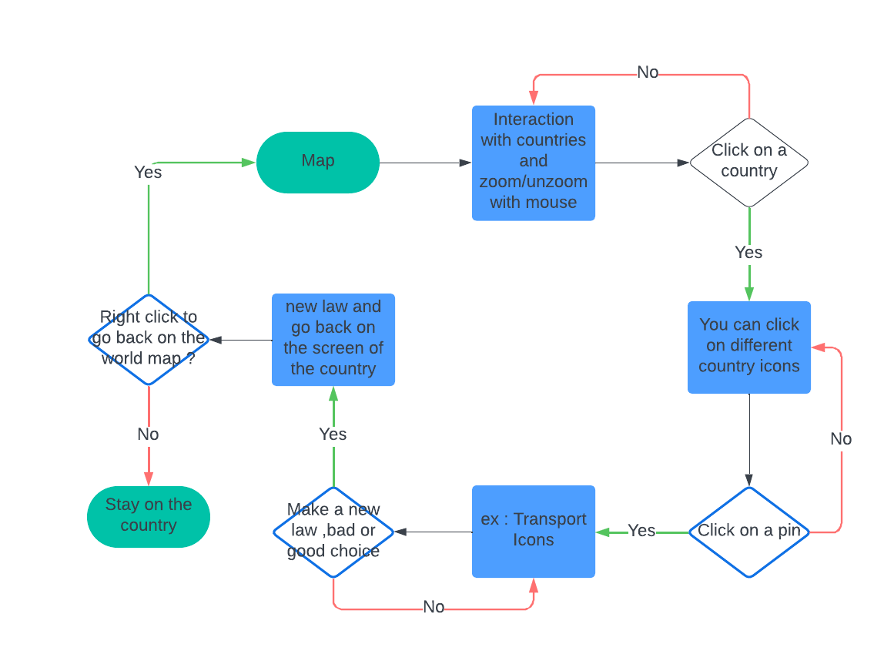
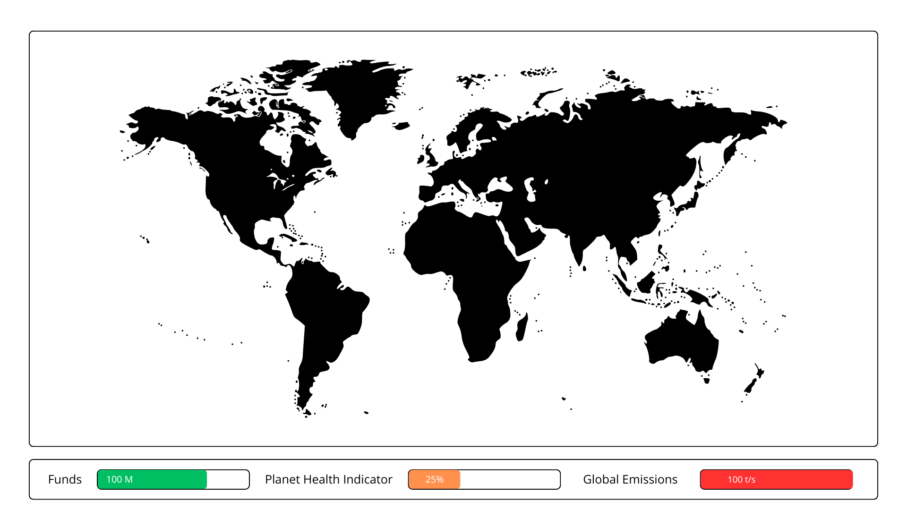
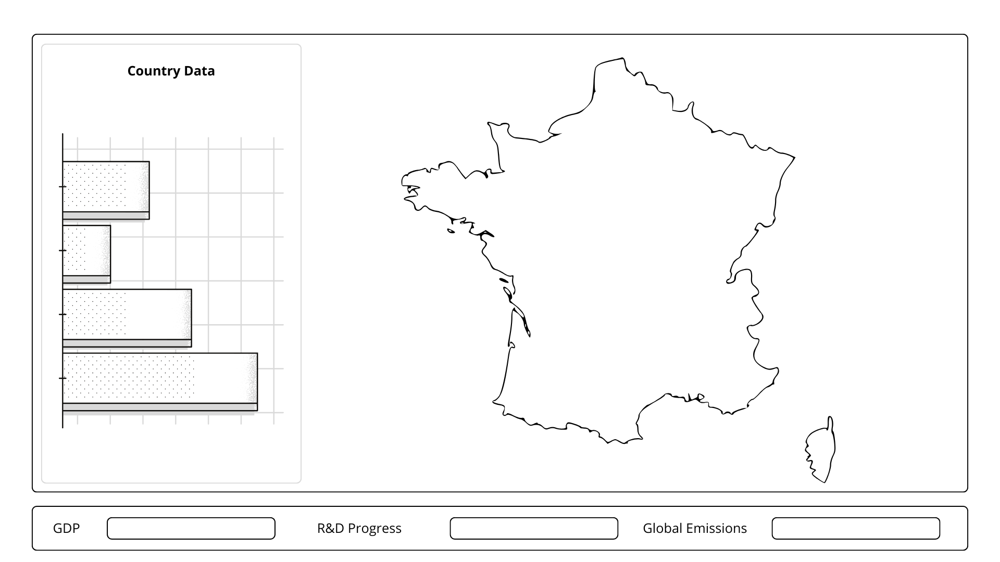

# Functional Specifications

## Table of content

- [Functional Specifications](#functional-specifications)
  - [Table of content](#table-of-content)
- [Introduction](#introduction)
  - [Overview](#overview)
  - [Project Definition](#project-definition)
    - [Vision](#vision)
    - [Objectives](#objectives)
    - [Scope](#scope)
      - [In Scope:](#in-scope)
      - [Out of Scope:](#out-of-scope)
    - [Target Audience](#target-audience)
    - [User Personas](#user-personas)
    - [Deliverables](#deliverables)
  - [Project Organization](#project-organization)
    - [Stakeholders](#stakeholders)
    - [Project Team](#project-team)
    - [Team Roles](#team-roles)
- [Functional Requirements](#functional-requirements)
  - [Serious Game Overview](#serious-game-overview)
    - [Theme](#theme)
    - [Game objectives](#game-objectives)
    - [Player Goals](#player-goals)
  - [Serious Game Design \& Mechanics](#serious-game-design--mechanics)
    - [Menu](#menu)
      - [1. Design](#1-design)
      - [2. mechanics](#2-mechanics)
    - [Map](#map)
      - [1. Design](#1-design-1)
      - [2. Mechanics](#2-mechanics-1)
    - [HUD (Heads-Up Display)](#hud-heads-up-display)
      - [1. Design](#1-design-2)
      - [2. Mechanics](#2-mechanics-2)
    - [Pin \& Icon System](#pin--icon-system)
      - [1. Design](#1-design-3)
      - [2. Mechanics](#2-mechanics-3)
- [Non-Functional Requirements](#non-functional-requirements)
  - [Performance Requirements](#performance-requirements)
  - [Usability Requirements](#usability-requirements)
  - [Maintainability Requirements](#maintainability-requirements)
  - [Portability Requirements](#portability-requirements)
- [Glossary](#glossary)

# Introduction

## Overview

We were tasked to make our own serious game using *Godot* with *GDSript* language. Climat changes need to be the main topic.

## Project Definition

### Vision 
---

Make and design a **serious game** with our own ideas and talk about **climat changes** in an **educational way**.

### Objectives
---

- Make a serious game.
- The topic need to be climat changes.
- Has to be made using Godot.
- The programming language has to be GDScript.

### Scope
---

#### In Scope:

1. **Game Development**:
    
    - Develop a **serious game** that simulates geopolitical and ecological decision-making focused on climate change.
    - Include a **zoomable planisphere** with real-time indicators of ecological, economic, and geopolitical states.
    - Implement gameplay mechanics for:
        - Creating and updating **legal restrictions** to influence industries.
        - Modifying or destructing industrial activities to reduce environmental impact.
        - Investing in **research and development** at country, continent, or global levels.
2. **Realistic Simulation**:
    
    - Ensure actions and their consequences unfold over time, reflecting **real-world dynamics**.
    - Incorporate **realistic representations** of ecological and political challenges without oversimplified mechanics.
3. **Educational Features**:
    
    - Provide **real-time feedback** to players, showing the outcomes of their decisions, such as:
        - Changes in global temperature.
        - Improved or degraded ecosystems.
        - Economic and political ripple effects.
    - Teach players about the interconnectedness of environmental, political, and industrial systems.
4. **Technical Details**:
    
    - Use the **Godot Engine** for development.
    - Program the game entirely in **GDScript**.
    - Ensure immersive gameplay with **2D graphics**, and a **clear focus on educational goals**.
5. **Delivery**:
    
    - Deliver a **playable prototype** game that demonstrates the full scope of features mentioned above.

#### Out of Scope:

1. **Commercial Release**:
    
    - The game will not be published for commercial purposes.
    - No marketing, distribution, or monetization activities will be undertaken.
2. **Multiplayer or Complex Online Features**:
    
    - The game will not include multiplayer components or large-scale online connectivity.
3. **Expansions Beyond Initial Scope**:
    
    - The scope is limited to the specified gameplay features and will not include expansions such as:
        - Deep space exploration.
        - Historical or speculative timelines outside of the modern era.
4. **Porting to Other Platforms**:
    
    - The game will not be ported to other engines or platforms beyond the Godot Engine for PC.

### Target Audience
---

The target audience for this serious game includes individuals aged **14 and above**, with a particular focus on students, educators, and environmentally conscious gamers. This audience is interested in **learning about climate change**, exploring **geopolitical and ecological interactions**, and understanding the **real-world challenges** of balancing environmental, economic, and political decisions. The game is designed to be educational yet engaging, appealing to both **casual players** and those with a deeper interest in environmental science and policy.

### User Personas
---

| **Persona**                 | **Description**                                                                                      | **Profile Image**                                                                                   |
|-----------------------------|------------------------------------------------------------------------------------------------------|-----------------------------------------------------------------------------------------------------|
| **Alex, the High School Student** | A 16-year-old student interested in science and geography. Curious about the effects of climate decisions. |  |
| **Dr. Rachel, the Environmental Science Teacher** | A 34-year-old high school teacher passionate about inspiring her students through engaging educational tools. |  |
| **Mark, the Aspiring Policy Maker** | A 21-year-old university student aiming to understand global policy decisions and their ecological impact. |  |

### Deliverables
---

| Name | Type | Deadline |
| --- | --- | --- |
| Functional Specifications Document	 | Document (markdown) | 11/22/2024 |
| Technical Specifications Document | Document (markdown) | 11/29/2024 |
| Test Plan and Test Cases | Document (markdown) | 12/06/2024 | 
| User Manual | Document (PDF) | 12/13/2024 | 
| Code | Code | 12/13/2024 |
| Weekly reports | Document (markdown) | Every Friday | 

## Project Organization
### Stakeholders
---

| Name | Occupation | Links |
| --- | --- | --- |
| ALGOSUP | Client | [Website](https://algosup.com) |

### Project Team
---

| **Picture**                                                                                     | **Name**               | **Role**          | **Links**                                                                                                                                       |
| ----------------------------------------------------------------------------------------------- | ---------------------- | ----------------- | ----------------------------------------------------------------------------------------------------------------------------------------------- |
|  | **Yann-Maël Bouton**  | Project Manager   |   |
|  | **Lucas Megnan**  | Program Manager   |   |
|  | **Alexandre Bopp** | Technical Leader  |   |
|  | **Enoal Adam**    | Technical Writer  |   |
|  | **Abdrazaq Makran** | Software Engineer |   |
|  | **Vianney Polard**   | Quality Assurance |   |

### Team Roles
---

| Role | Description |  
| --- | --- |
| **Project Manager** | Responsible for overall project planning, coordination, and communication. |
| **Program Manager** | Responsible of deadlines and deliverables. Design of the project is under his direction. Should deliver the functional specification. |
| **Technical Leader**| Guides the technical development and architectural decisions of the game, ensuring the implementation of best practices and high-quality code. |
| **Softawre Engineer** | Develops and implements the game’s code, focusing on gameplay mechanics, user interface, and system performance. |
| **Quality Assurance** | Ensures the game meets high standards by testing for bugs, performance issues, and overall functionality across different scenarios. |
| **Technical Writer** | Responsible for documenting the project and creating user manuals. |

# Functional Requirements

## Serious Game Overview

### Theme
---

The game, Ecosphere, immerses players in a global crisis scenario, challenging them to address and mitigate the devastating impacts of climate change. Acting as decision-makers, players will navigate the complex interplay of **economy, politics, and environmental sustainability**, learning firsthand the difficulties of implementing effective climate solutions in the real world.

Players will take on the responsibility of:

- **Passing laws** to regulate industries and reduce environmental harm.
- **Investing in research and green technologies** to drive sustainable development.
- **Managing geopolitical challenges while balancing** national and global interests.

Every action triggers consequences: cutting emissions could improve environmental health but at the expense of economic growth, while prioritizing economic activity might accelerate ecological decline. Real-time feedback, such as visualized data on rising temperatures, fluctuating CO₂ levels, and recovering ecosystems, helps players see the tangible outcomes of their decisions.

This simulation teaches that solving climate challenges requires strategic thinking, collaboration, and long-term commitment, showing how even incremental changes can lead to meaningful impacts.

### Game objectives
---

**1.** **Educate and Engage**: Help players understand the interconnectedness of economic, environmental, and political systems in the context of climate change.

**2.** **Encourage Strategic Thinking**: Challenge players to develop thoughtful strategies that balance short-term and long-term goals.

**3.** **Raise Awareness**: Provide an immersive experience that highlights the complexities and urgency of global climate action.

**4.** **Foster Actionable Knowledge**: Equip players with insights into real-world climate solutions, inspiring them to advocate for or implement sustainable practices in their lives.

### Player Goals
---

**1. Reverse Climate Change**: Take decisive actions to reduce global carbon emissions, halt deforestation, and curb environmental degradation.

**2. Achieve Sustainability**: Balance ecological, economic, and social factors to create a stable and thriving global system.

**3. Optimize Resources**: Allocate limited resources efficiently across regions, industries, and technologies to maximize impact.

**4. Maintain Global Stability**: Address geopolitical tensions and social unrest while pursuing environmental goals.

**5. Innovate for the Future**: Invest in and deploy cutting-edge technologies to solve complex climate challenges.

**6. Adapt and Learn**: Respond to emerging crises and evolving scenarios with flexibility and strategic foresight.

Players will need to plan, implement, and adapt their decisions as they strive to create a sustainable future for the planet.

## Serious Game Design & Mechanics

### Menu

#### 1. Design
---

The design is really simple, including the name of the game on the top middle of the screen, and buttons **'play'**, **'How to Play'** and **'Quit'**.

#### 2. mechanics
---

### Map

#### 1. Design
---

- A **zoomable 2D world map** featuring interactive elements such as:
  - Nations.
  - Climate and industry indicators.
  - Geopolitical statuses.

#### 2. Mechanics
---

- Players can:
  - Enact policies at a **national level**.
  - Monitor global **ecological conditions** via map overlays.
  - Track **progress indicators** like CO₂ levels or deforestation rates.

 

### HUD (Heads-Up Display)

#### 1. Design
---

- A clean, intuitive interface that provides **real-time data** for players to monitor their decisions' impact and plan their next steps.
- Key HUD elements include:

    **1. Resource Meters**:
    - **Funds**: Displays the available economic resources for policies, research, and development.
    - **Global Emissions**: Shows current CO₂ output and how it trends over time.
    - **Planet Health Indicators**: Tracks metrics like global temperature, deforestation rate, and biodiversity index.
  
    **2. Country-Specific Data**:
    - **GDP** (Gross Domestic Product): Indicates a country’s economic capacity and determines available resources for investments or scientific research.
    - **Scientific Progress Bar**: Visualizes ongoing research activities and their time to completion.
  
    **3. Player Feedback Panel**:
    - Shows the outcomes of player decisions in terms of **ecological, economic, and geopolitical changes**.
    - Critical **alerts** for disasters or urgent matters.

    **4. Map Interaction Menu**:
    - Allows access to national data, laws, industries, and global overlays.

**HUD of the world map:**

**HUD of a country map:**

#### 2. Mechanics
---

- The HUD dynamically updates based on player actions and global events:
  - **Funds and GDP**:
    - **GDP** grows or shrinks depending on the nation's policies and industrial activities.
    - Allocate a percentage of GDP to **scientific research** for technological advancements or sustainable solutions.
  - **Scientific Research System**:
    - Players can fund scientists to research **new technologies** or **climate solutions**.
    - Completed research unlocks tools like **renewable energy technologies**, **carbon capture systems**, or **drought-resistant crops**.
    - Research projects require time and are influenced by **funding levels** and **geopolitical stability**.
  - **Planet Health Metrics**:
    - Real-time feedback on environmental trends to help players assess the effectiveness of their strategies.
    - Includes visible consequences like rising sea levels, desertification, or ecosystem restoration.
  - **Alert Notifications**:
    - Warns players of critical issues such as **natural disasters**, **political unrest**, or **scientific breakthroughs**.

**Integration of GDP and Research**

- GDP acts as the **financial backbone**:
  - Players must maintain GDP to fund **research** while minimizing harm to the environment.
  - Excessive industrial expansion may increase GDP temporarily but lead to higher **emissions** and **ecological degradation**.
- The **scientific research system** challenges players to:
  - Prioritize research areas based on current global challenges.
  - Balance short-term GDP sacrifices with long-term sustainability goals. 

### Pin & Icon System

#### 1. Design
---

#### 2. Mechanics
---

---

All designs & mechanics can evolve during the development of the serious game.
All our Information come from the website : [Worldemission.io](https://worldemissions.io/?campaignid=20369193522&adgroupid=155060989647&adid=665839090473&utm_term=co2%20emissions%20by%20country&utm_campaign=World+Emissions+Clock&utm_source=adwords&utm_medium=ppc&hsa_acc=3460487076&hsa_cam=20369193522&hsa_grp=155060989647&hsa_ad=665839090473&hsa_src=g&hsa_tgt=kwd-489531936952&hsa_kw=co2%20emissions%20by%20country&hsa_mt=b&hsa_net=adwords&hsa_ver=3&gad_source=1&gclid=CjwKCAiArva5BhBiEiwA-oTnXWDYR0cr3v6u_4X9h-s2HxtYd7UgZNEKtFOlrfGHee3CXUc9_73H2xoCjskQAvD_BwE)

# Non-Functional Requirements

## Performance Requirements
---

1. **Game Performance**:
   - The game must maintain a consistent **60 frames per second (FPS)** on mid-tier computers (e.g., with at least 8GB of RAM, 2GB VRAM, and a mid-range CPU).
   - Loading times for large assets like the map and overlays must not exceed **5 seconds**.

2. **Responsiveness**:
   - All user interactions, such as map zooming or enacting policies, should have a response time of **under 200ms**.

3. **Scalability**:
   - The system should handle increasing levels of complexity as more policies, overlays, and events are added without significant degradation in performance.

## Usability Requirements
---

1. **Intuitive Design**:
   - The game interface must be easy to navigate for users aged 14 and above, with **clear User Manual** and **contextual tooltips** explaining key features.
   - Ensure minimal cognitive load by presenting **critical information upfront** and providing an optional **in-depth exploration menu** for advanced players.

## Maintainability Requirements
---

1. **Modular Codebase**:
   - Code must be written in a **modular and reusable** way to allow future updates and bug fixes without significant refactoring.
   - All GDScript files must follow a clear structure, with well-documented functions and consistent naming conventions.

2. **Version Control**:
   - Use Git for source code management, ensuring all changes are tracked with meaningful commit messages.

More information on the Technical Specification.

## Portability Requirements
---

1. **Operating System Compatibility**:
   - The game must run on **Windows** and **macOS** systems.
   - The game is available on our GitHub.

# Glossary

| **Term**                  | **Definition**                                                                                                                                                                     |
|---------------------------|-------------------------------------------------------------------------------------------------------------------------------------------------------------------------------------|
| **Serious Game**           | A game designed for educational purposes, focusing on teaching players about real-world challenges, such as climate change, while still being engaging and interactive.             |
| **Godot Engine**           | An open-source game development platform used to create 2D and 3D games.                                                                                                         |
| **GDScript**               | A high-level, dynamically-typed programming language used in the Godot Engine, optimized for game development.                                                                    |
| **Zoomable Planisphere**   | A 2D interactive world map that players can zoom in or out to view regions at different levels of detail.                                                                         |
| **GDP (Gross Domestic Product)** | A measure of a nation's total economic output, used in the game to determine the availability of resources for research, policies, and development.                                   |
| **Scientific Research System** | A gameplay mechanic allowing players to fund and direct research projects to discover and unlock new climate solutions or technologies.                                          |
| **CO₂ Levels**             | A metric representing the concentration of carbon dioxide in the atmosphere, a key factor in global warming.                                                                      |
| **Planet Health Metrics**  | Indicators used to visualize the state of the planet's environment, such as global temperature, biodiversity, and deforestation rates.                                             |
| **Modular Codebase**       | A software development practice where code is divided into smaller, independent modules, making it easier to update and maintain.                                                  |
| **Colorblind-Friendly Mode** | A feature that adjusts in-game colors to ensure that colorblind players can distinguish important visual elements.                                                               |
| **Accessibility**          | Design practices that ensure the game can be played by a wide range of people, including those with disabilities or impairments.                                                  |