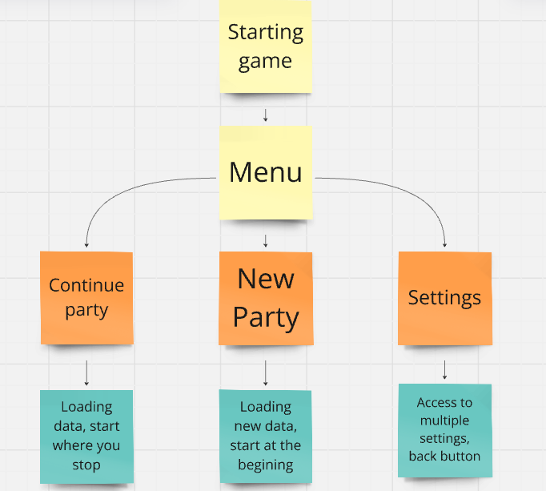

# Technical Specifications : Project serious game

| Engine | Project | Year | Shool | Team |
|--------|---------|------|-------|------|
| |  Serious Game  | 2024-2025 | Algosup | 2 |

## Last update and review

| Name | Date |
|------|------|
| Bopp Alexandre | 11/8/2024 |
| Polard Vianney | XX/XX/XXXX |

## Serious Game Using godot engine 


## Introduction to godot 

Godot is a free and open-source game engine that offers a comprehensive set of tools for 2D and 3D game development. It features a unique node-based architecture, a built-in scripting language called GDScript (similar to Python), and support for visual scripting. Godot is known for its lightweight nature, cross-platform compatibility, and active community support, making it an excellent choice for both beginners and experienced developers looking to create games or interactive applications.

## Summary 

Nothing for now 

## I. The project goal 

The goal of the project is to create a serious game about climate change, aimed at teaching players the importance of their actions on the planet.

## II. The project requirements 

### a. Project

| **Topic**                | **Requirements**                                                                                                          |
|--------------------------|---------------------------------------------------------------------------------------------------------------------------|
| **Engine**               | Use the GODOT 4.3 engine for game development. (not mandatory)                                                                           |
| **Game Type**            | Design and produce a serious game focused on **Climate Change**.                                                          |
| **Game Design**          | Follow standard game design and development principles to ensure a polished product.                                      |
| **Scope**                | Create a **small but polished** game that meets high standards of design and functionality.                               |
| **Testing**              | Conduct continuous testing throughout the development process to ensure quality.                                          |
| **Final Deliverable**    | The game should be engaging, bug-free, and feature-complete to the extent possible.                                       |
| **Game Theme**           | Climate Change is the main theme; the game should educate players on environmental impact and responsible actions.        |
| **Sub-Theme Options**    | Choose a specific climate-related topic (e.g., nuclear power, rising temperatures, mobility options, wildfires, etc).     |
| **Genre Flexibility**    | Each team may choose the game sub-genre (e.g., strategy, card game, trivia, platformer, etc.).                            |
| **Music**                | Use free sound assets or create original music for the game.                                                          |    

### b. Project Management

For effective project versioning and management, it is essential to use **GitHub**, a robust version control platform that facilitates collaboration and project tracking.

#### 1. What is GitHub?

**GitHub** is a powerful, web-based platform built around **Git**, a version control system that allows multiple contributors to track, manage, and collaborate on code and other project files seamlessly. Using GitHub for this project offers multiple advantages:

1. **Project Tracking and Documentation**: GitHub allows teachers and team members to view, comment on, and review project progress in real-time. This level of visibility helps ensure that each member's contributions are tracked accurately, and issues can be flagged and addressed efficiently.

2. **Version Control and Recovery**: GitHub’s version control capabilities mean that every change made is saved as a snapshot, or “commit.” This allows us to easily track the evolution of the project over time. If files or code are deleted or corrupted, previous versions can be retrieved and restored effortlessly.

3. **Collaboration**: GitHub makes collaborative work more effective by providing tools for code merging, branching, and pull requests. Team members can work on their own sections of the project without disrupting each other’s work, then merge contributions as they are completed and approved.

4. **Project Organization**: GitHub also offers options for issue tracking, milestones, and project boards, which allow for detailed tracking of tasks, bugs, and features. This is essential for managing the scope and priorities of the project.

GitHub’s version control and collaboration tools will play an essential role in this project, helping the team maintain organization, prevent data loss, and deliver a high-quality final product.

#### 2. What is a Branch in Git?

A **branch** in Git is a separate line of development that allows team members to work on different features, fixes, or tasks independently. Branches enable us to work efficiently and remain organized by isolating changes until they are ready to be integrated into the main project. For example, each new feature or bug fix can have its own branch, so work can be completed, tested, and reviewed independently before merging.

## Git Repository Structure

```plaintext
Main
├── documents
├── src
└── Readme.md
dev
├── src
├── .DS_Store
└── Readme.md
Documents_managements
├── Documents/management
├── .DS_Store
├── .gitignore
└── Readme.md
Documents_quality_insurance
├── documents
└── Readme.md
Documents
├── documents
│   ├── Functionnal_specifications
│   ├── management/weekly
│   ├── Technical_specifications
│   └── user_manual
└── Readme.md
```


#### 3. How Does Git Work?

Git provides several commands to manage branches and perform essential tasks. Below is a list of the primary Git commands used in this project:

| Command            | Description |
|--------------------|-------------|
| `git init`         | Initializes a new Git repository in the current folder. This command is only used once when setting up the repository for the first time. |
| `git clone <url>`  | Creates a local copy of an existing Git repository from a remote source (e.g., GitHub) so you can begin working on it. |
| `git branch <name>`| Creates a new branch with the specified name. This branch allows you to work on a feature or fix independently of the main codebase. |
| `git checkout <branch>` | Switches to the specified branch, allowing you to work within that branch without affecting other branches. |
| `git add <file>`   | Stages changes made to the specified file(s), preparing them to be committed. Use `git add .` to stage all changes in the current directory. |
| `git commit -m "message"` | Saves your staged changes to the branch with a message describing the changes. |
| `git push`         | Uploads your committed changes to the remote repository (e.g., GitHub) so others can access them. |
| `git pull`         | Retrieves updates from the remote repository to your local repository, ensuring you are working with the latest version. |
| `git merge <branch>` | Combines changes from the specified branch into the current branch, effectively integrating the branch's updates. |
| `git status`       | Shows the current status of files in your working directory, including staged, unstaged, and untracked files. |
| `git log`          | Displays a list of all past commits in the current branch, showing commit messages, authors, and timestamps. |

Using these commands effectively allows us to maintain a clean and organized codebase, collaborate smoothly, and minimize conflicts or disruptions during development.


## III. Term definitions 

| **Term**                  | **Definition**                                                                                                           |
|---------------------------|--------------------------------------------------------------------------------------------------------------------------|
| **2D**                    | 2D, or two-dimensional, refers to a flat plane where objects and environments are represented using only two dimensions: height and width. |
| **Node**                  | A fundamental element in Godot that acts as a building block for creating scenes. Each node has its own properties and can be used for different purposes, like physics, visuals, or scripting. |
| **Scene**                 | A collection of nodes organized in a tree structure. Scenes are modular components in Godot and can be reused, combined, and instanced within other scenes. |
| **Sprite**                | A 2D graphic object that represents images and animations in the game, commonly used for characters, objects, and backgrounds. |
| **Script**                | A code file attached to nodes to define custom behavior, often written in Godot's GDScript or other compatible languages like C#. |
| **GDScript**              | Godot's integrated scripting language, designed to be optimized and user-friendly for game development within the Godot engine. |
| **Signal**                | A messaging system in Godot used to send notifications between nodes, allowing for decoupling and modular communication within the scene. |
| **Physics Body**          | Nodes such as `KinematicBody2D`, `RigidBody2D`, or `StaticBody2D` used for handling physics interactions and collisions in the game world. |
| **Collision Shape**       | A node defining the shape for collision detection on physics bodies, determining how they interact with other objects in the game. |
| **Viewport**              | The rendering surface in Godot where scenes are displayed. Viewports are used to create layered effects, cameras, and multiple rendering areas. |
| **Canvas Layer**          | A Godot node used for positioning elements in 2D space, such as user interfaces or HUDs, that are unaffected by the main camera's movement. |
| **Script Lifecycle**      | The set of functions like `_ready()`, `_process()`, and `_physics_process()` that dictate a script's behavior during each game loop. |
| **Resource**              | Assets and data in Godot, such as textures, sounds, and scripts, which can be imported and used throughout the project. |
| **Instance**              | A reusable copy of a scene or node that can be added to other scenes, allowing for modular and efficient game design. |
| **Global State**          | A game-wide variable or singleton used to store data or control that must persist and be accessible across different scenes. |
| **Delta Time**            | The time elapsed between frames, used in functions like `_process(delta)` to ensure smooth and frame-rate independent movement. |
| **Inspector**             | A Godot panel that allows developers to view and adjust the properties of selected nodes and resources in the editor. |
| **Animation Player**      | A node used to create and manage complex animations by animating properties of nodes over time. |
| **UI (User Interface)**   | Elements like buttons, labels, and progress bars that allow the player to interact with the game; typically managed by CanvasLayer nodes. |
| **Shader**                | A script or program that manipulates the rendering of images on screen, often used for special effects like lighting and shading. |
| **Frame Rate**            | The frequency at which frames are rendered per second, affecting the smoothness of animations and gameplay experience. |
| **GDNative**              | A system in Godot that allows for integrating native C/C++ code with Godot, used for performance-intensive tasks. |


## IV. Godot Utilization & Code Architecture

Godot provides a wide range of built-in templates and nodes that can be easily customized for your game. You can drag and drop nodes to create complex scenes and behaviors quickly. The engine also includes a scripting section where you can write custom code to handle game logic, such as player movement, interactions, or AI behaviors.

### 1. Key Points to Remember:
- **Node Structure**: Carefully check each node connection. Proper node hierarchy and links are crucial for your game to function as intended in Godot.
- **Signals**: Use signals to manage and track specific events in your game (e.g., player interactions, collisions, or triggering animations).
- **Scene Management**: Once you've set up a scene with nodes and scripts, save it and then drag it into your main game scene to integrate it with the overall gameplay.

### 2. Godot Tree Structure:

In Godot, your project scene will typically consist of multiple nodes organized hierarchically. Here's our example of a basic scene tree might look like:

```txt
res://
├── addons     # Folder reserved for plugins and custom modules that extend the functionality of the Godot engine.
├── assets     # Folder for storing various assets such as images, models, textures, and other reusable resources.
|  ├── sounds  # Used for sound effects, music, and other audio assets, keeping audio files organized.
|  ├── fonts   # Designated for font files used in the game, making it easy to manage typography across UI components.
├── scenes     # Contains the main scenes of the game; each scene represents a specific game object.
├── scripts    # Holds GDScript files used to add functionality to nodes within scenes, separating logic from resources.
├── ui         # Contains user interface elements like button images, icons, and other UI assets.
└── icon.svg   # The project icon, often the Godot logo or a custom icon representing the project.

```

### 3. Project Naming Convention Statement

In this project, we will follow the **snake_case** naming convention for all assets, scripts, and identifiers.

#### What is **snake_case**?

**snake_case** is a naming convention where all letters are lowercase, and words are separated by underscores (`_`). This makes the names more readable and consistent, especially in file systems and programming languages that do not allow spaces in identifiers.

| Convention | Examples |
|------------|----------|
| **snake_case** | `game_scene.tscn`, `update_score()` |


### 4. Godot system requirements

We are using Godot on our school's laptops, and it's important to know the minimum system requirements for the engine to run smoothly. Although it can also be used on phones, we are not using it for mobile development.

<details>
  <summary>Minimum configuration for usage</summary>

  <table>
    <thead>
      <tr>
        <th><strong>Desktop or Laptop PC</strong></th>
        <th><strong>Minimum Requirements</strong></th>
      </tr>
    </thead>
    <tbody>
      <tr>
        <td><strong>CPU</strong></td>
        <td>
          <ul>
            <li><strong>Windows</strong>: x86_32 CPU with SSE2 instructions, or any x86_64 CPU<br>Example: Intel Core 2 Duo E8200, AMD Athlon XE BE-2300</li>
            <li><strong>macOS</strong>: x86_64 or ARM CPU (Apple Silicon)<br>Example: Intel Core 2 Duo SU9400, Apple M1</li>
            <li><strong>Linux</strong>: x86_32 CPU with SSE2 instructions, x86_64 CPU, ARMv7 or ARMv8<br>Example: Intel Core 2 Duo E8200, AMD Athlon XE BE-2300, Raspberry Pi 4</li>
          </ul>
        </td>
      </tr>
      <tr>
        <td><strong>GPU</strong></td>
        <td>
          <ul>
            <li><strong>Forward+ Rendering Method</strong>: Integrated graphics with Vulkan 1.0 support<br>Example: Intel HD Graphics 5500 (Broadwell), AMD Radeon R5 Graphics (Kaveri)</li>
            <li><strong>Mobile Rendering Method</strong>: Integrated graphics with full Vulkan 1.0 support<br>Example: Intel HD Graphics 5500 (Broadwell), AMD Radeon R5 Graphics (Kaveri)</li>
            <li><strong>Compatibility Rendering Method</strong>: Integrated graphics with OpenGL 3.3 support<br>Example: Intel HD Graphics 2500 (Ivy Bridge), AMD Radeon R5 Graphics (Kaveri)</li>
          </ul>
        </td>
      </tr>
      <tr>
        <td><strong>RAM</strong></td>
        <td>
          <ul>
            <li>Native editor: 4 GB</li>
            <li>Web editor: 8 GB</li>
          </ul>
        </td>
      </tr>
      <tr>
        <td><strong>Storage</strong></td>
        <td>
          <ul>
            <li>200 MB (used for executable, project files, and cache)</li>
            <li>Exporting projects requires separate download of export templates (1.3 GB after installation)</li>
          </ul>
        </td>
      </tr>
      <tr>
        <td><strong>Operating System</strong></td>
        <td>
          <ul>
            <li><strong>Native editor</strong>: Windows 7, macOS 10.13 (Compatibility) or macOS 10.15 (Forward+/Mobile), Linux distribution from 2016 or later</li>
            <li><strong>Web editor</strong>: Firefox 79, Chrome 68, Edge 79, Safari 15.2, Opera 64</li>
          </ul>
        </td>
      </tr>
    </tbody>
  </table>

</details>


<details>
  <summary>Minimum configuration for the export</summary>

  <table>
    <thead>
      <tr>
        <th><strong>Desktop or Laptop PC</strong></th>
        <th><strong>Minimum Requirements</strong></th>
      </tr>
    </thead>
    <tbody>
      <tr>
        <td><strong>CPU</strong></td>
        <td>
          <ul>
            <li><strong>Windows</strong>: x86_32 CPU with SSE2 instructions, or any x86_64 CPU<br>Example: Intel Core 2 Duo E8200, AMD Athlon XE BE-2300</li>
            <li><strong>macOS</strong>: x86_64 or ARM CPU (Apple Silicon)<br>Example: Intel Core 2 Duo SU9400, Apple M1</li>
            <li><strong>Linux</strong>: x86_32 CPU with SSE2 instructions, x86_64 CPU, ARMv7 or ARMv8 CPU<br>Example: Intel Core 2 Duo E8200, AMD Athlon XE BE-2300, Raspberry Pi 4</li>
          </ul>
        </td>
      </tr>
      <tr>
        <td><strong>GPU</strong></td>
        <td>
          <ul>
            <li><strong>Forward+ Rendering Method</strong>: Integrated graphics with Vulkan 1.0 support<br>Example: Intel HD Graphics 5500 (Broadwell), AMD Radeon R5 Graphics (Kaveri)</li>
            <li><strong>Mobile Rendering Method</strong>: Integrated graphics with full Vulkan 1.0 support<br>Example: Intel HD Graphics 5500 (Broadwell), AMD Radeon R5 Graphics (Kaveri)</li>
            <li><strong>Compatibility Rendering Method</strong>: Integrated graphics with OpenGL 3.3 support<br>Example: Intel HD Graphics 2500 (Ivy Bridge), AMD Radeon R5 Graphics (Kaveri)</li>
          </ul>
        </td>
      </tr>
      <tr>
        <td><strong>RAM</strong></td>
        <td>
          <ul>
            <li>For native exports: 2 GB</li>
            <li>For web exports: 4 GB</li>
          </ul>
        </td>
      </tr>
      <tr>
        <td><strong>Storage</strong></td>
        <td>
          <ul>
            <li>150 MB (used for executable, project files, and cache)</li>
          </ul>
        </td>
      </tr>
      <tr>
        <td><strong>Operating System</strong></td>
        <td>
          <ul>
            <li><strong>For native exports</strong>: Windows 7, macOS 10.13 (Compatibility) or macOS 10.15 (Forward+/Mobile), Linux distribution from 2016 or later</li>
            <li><strong>For web exports</strong>: Firefox 79, Chrome 68, Edge 79, Safari 15.2, Opera 64</li>
          </ul>
        </td>
      </tr>
    </tbody>
  </table>

</details>

## V. Map and code logic

Our map is a 2D planisphere, providing a top view of the entire European continent. You can click on a specific area, and the map will zoom in on the selected country.

### a. Map 


**Selection and Zooming:** At the beginning, you can view the full map and click on any country. When you click on a country, the game automatically zooms in on it. You can use your mouse to zoom out if needed.

**Country Structure:** When a country is zoomed in, you can see multiple tasks displayed with different colors representing various ecological states.

**Data Structure:** Information about each European country is stored in a dictionary. This dictionary holds useful details, such as the country name, ecological states, and other information to display when the country is selected.

**Information Display:** Include Labels as UI elements to show details about the selected country. These labels display information such as the country's name, ecological states, and more.

### b. Color States

To enhance visual clarity and support immersive gameplay, we have established a color-coded system with five distinct colors. Each color represents the ecological status of a zone and indicates the urgency of any required player actions.

| Color       | State Description |
|-------------|-------------------|
| **Green**   | Optimal: The zone is fully optimized for climate impact, and no further improvements can be made. |
| **Yellow**  | Moderate: Improvements are recommended, although the current state poses minimal risk to the environment. |
| **Orange**  | Average: The zone is balanced between positive and negative impacts. Adjustments are advisable, though not immediately critical. |
| **Red**     | Critical: The zone is in a damaging state. Player intervention is required to prevent further environmental degradation. |
| **Black**   | Disaster: The zone has experienced an ecological disaster, significantly impacting the climate. Immediate action is required. |

Using the left-click, players can allocate GDP(gross domestic product) to upgrade a zone's environmental status. Upgrades are tied to the country’s GDP, and careful consideration is needed to prioritize spending.

There are five types of upgrades, each addressing a specific environmental factor. When selected, an upgrade will consume a portion of GDP and immediately improve the zone’s color status. If a zone moves from **Yellow** to **Green**, for instance, it indicates a successful optimization of environmental impact. Each improvement shifts the color state towards a less critical status, reflecting progress toward ecological sustainability.


### c. Pin and icons system

We have 4 categories :

We have defined five main categories in agriculture, each representing a key area that affects the ecological status of a zone. These categories can be upgraded to reduce environmental impact and improve sustainability.

| Agriculture | Description | Icon |
|-------------|-------------|------|
| **Livestock** | Represents the impact of livestock farming on the environment, including greenhouse gas emissions, water usage, and land degradation. Upgrades in this category may focus on sustainable livestock practices, waste reduction, and improved animal welfare. | 
**Crops**            | Covers the production and management of various crops. The focus is on soil health, pesticide use, water conservation, and crop rotation. Upgrades here can lead to reduced chemical runoff and improved resilience to climate change. |  |

<br>

| Transport    | Description                                                                                                                                    | Icon                                             |
|--------------|------------------------------------------------------------------------------------------------------------------------------------------------|--------------------------------------------------|
| **Car**      | Represents the environmental impact of personal and small vehicle transportation, including emissions and fuel consumption. Upgrades may focus on reducing carbon output, promoting electric vehicles, and increasing fuel efficiency. |  |
| **Bus/Truck** | Encompasses larger land vehicles used for public and freight transportation. This category emphasizes emissions reduction, fuel optimization, and transitioning to sustainable energy sources. |  |
| **Subway**   | Represents underground or metropolitan rail systems, which generally offer lower emissions per passenger. Improvements in this category could enhance energy efficiency and optimize route planning for reduced impact. |  |
| **Boat**     | Focuses on the impact of water-based transport, from cargo ships to personal boats. Key areas include fuel emissions, wastewater management, and transitions to cleaner energy sources. |  |
| **Plane**    | Represents the environmental impact of air travel, which is a significant source of greenhouse gas emissions. Upgrades can include carbon offset programs, fuel efficiency improvements, and investments in alternative fuels. |  |

<br>

| Energy Systems           | Description                                                                                                          | Icon                                             |
|--------------------------|----------------------------------------------------------------------------------------------------------------------|--------------------------------------------------|
| **Coal Combustion**      | Electricity production using coal combustion, which results in high carbon emissions and pollution. Upgrades focus on reducing coal dependency and improving efficiency. |  |
| **Fossil Fuels**         | General energy production from fossil fuels, such as oil and coal, which contribute to greenhouse gas emissions. Improvements aim to reduce reliance on these non-renewable resources. |  |
| **Gas** | Electricity production using natural gas, which emits less CO₂ than coal but still has an environmental impact. Upgrades here focus on improving plant efficiency or transitioning to cleaner alternatives. |  |
| **Nuclear**              | Electricity production using nuclear energy, which has low greenhouse emissions but involves managing radioactive waste. Enhancements may focus on waste reduction and safety measures. |  |
| **Green Energy**         | Renewable energy sources like wind turbines and solar panels, providing clean alternatives to fossil fuels. Upgrades expand renewable energy capacity and efficiency. |  |

<br>

| Industry           | Description                                                                                                      | Icon                                             |
|--------------------|------------------------------------------------------------------------------------------------------------------|--------------------------------------------------|
| **Metals**         | Encompasses the extraction and processing of metals, which often involves high energy consumption and emissions. Key improvements focus on energy efficiency and reducing industrial waste. |  |
| **Chemicals**      | Involves the production of chemicals, which typically requires significant energy input and generates hazardous byproducts. Upgrades may focus on cleaner production methods and waste management. |  |
| **Waste**          | Includes the processing and management of waste materials, often requiring high energy input for waste incineration and disposal. Efforts here focus on improving recycling and reducing environmental impact. |  |
| **Cement**         | The cement industry is a major emitter of CO₂, primarily due to the high energy needs for limestone processing. Enhancements include reducing carbon emissions and improving energy efficiency. |  |
| **Other Industry** | Covers various industries that do not fall under the above categories, often characterized by energy-intensive processes. Improvements may target specific energy reductions or emissions control measures. |  |

#### 1. How icons render with the map ?

Directly on the map, when zooming into a country, you’ll see a top view of the country with multiple pins placed inside. Each pin represents a specific category, and within the pin, you'll see the corresponding icons we previously discussed, depending on the category.

Example :

| Map Pin  | Icon | 
|----------|------|
|||

Directly on the map, when zooming into a country, you’ll see a top view of the country with multiple pins placed inside. Each pin represents a specific category, such as the **Metals Industry**, and inside the pin, you’ll see the corresponding icons associated with that category.

Additionally, the color of each map pin will change based on the ecological **color state** that we defined earlier. The color of the pin reflects the current state of the environment in that specific area (Green, Yellow, Orange, Red, Black), indicating the urgency of intervention or improvement needed.


## VI. Game play mechanics

### a. Mouse

In this game, all tasks are controlled using the mouse. The following actions can be performed with different mouse interactions:

| Mouse Action       | Description                                                                                                                                                |
|--------------------|------------------------------------------------------------------------------------------------------------------------------------------------------------|
| **Left Click**     | Main interaction: Used to perform actions such as purchasing, zooming into a country, returning to the main menu, configuring settings, and selecting options. |
| **Right Click**    | Undo action: After a left-click, if the action is not completed, the right-click allows you to return to the previous state or cancel the action.            |
| **Mouse Wheel**    | Zoom out: Used to dezoom and view the entire map, allowing you to navigate between different countries and regions.                                          |

### b. Progress Bars

#### 1. GDP progress bar

In the game, **GDP (Gross Domestic Product)** represents the in-game currency. Each country has a progress bar that reflects its current GDP, which is automatically managed by the system. The progress bar fills over time, and as it fills, the player can use the GDP to purchase improvements for the country. However, each purchase is costly, and you must wait for the bar to fill before making additional purchases.

##### 1.1. Time Management:
The progress bar is based on the real **GDP** of the country. The rate at which it fills is influenced by the actions taken by the player. Actions that positively impact the country’s economy will increase the rate of progress, while negative actions may slow it down or even decrease the bar's value.

- The progress bar automatically updates in real-time, reflecting the country's economic changes based on the player's decisions.
- The rate of increase or decrease in the progress bar depends on the actions performed, influencing the country’s economic growth or decline.

#### 2. CO2 progress bar

A simple calculation is performed based on the actions taken by the player. Each action will either positively or negatively impact the **GDP progress bar**. If the management of the country deteriorates significantly, the progress bar will fill, and if it reaches its limit, it results in a catastrophic failure where all of humanity perishes.

In the event of a global collapse, the game will restart from the beginning.

##### 1.1. Key Objective:
The primary goal is to **reduce the progress bar** across all playable countries. The lower the progress bar, the better the economic and environmental management of the country. This mechanic encourages players to make decisions that optimize their country’s economy while avoiding disastrous consequences for humanity.

#### 3. Example Progress Bar

The progress bar is located in the top corner of the screen, providing a clear visual representation of the game's key characteristics and primary objectives. This bar displays important metrics, including the **GDP** and **CO2** levels, helping players track their progress and make informed decisions throughout the game.


### c. Scientist

**Scientist Icon**:


In the top corner of the game screen, you will find the **Scientist Icon**, which serves as a critical interface for advancing your country's progress in the game. Clicking this icon opens a dedicated interface where you can purchase **Knowledge** and **Solutions** using the available **GDP**. These purchases are essential for making strategic upgrades and unlocking advanced gameplay mechanics, aiding your efforts to address the country’s environmental, economic, and social challenges.

Through engaging with the Scientist, you gain access to essential information and options, including:

- **New Building Types**: Discover and invest in sustainable infrastructure that positively impacts your country’s GDP and environmental metrics.
- **Policy Options and Laws**: Research and enact policies to drive positive change in areas such as pollution control, sustainable farming, energy efficiency, and urban planning.
- **Exclusive Knowledge**: Purchase insights that provide strategic benefits, offering tools, resources, or abilities that streamline your country’s development.

Each investment in Knowledge or Solutions offers long-term benefits. New buildings or policies may enhance the economy while reducing environmental strain, and certain upgrades introduce innovations that provide strategic advantages over time. These investments are key to balancing GDP growth with environmental sustainability, guiding your country toward an optimized ecological and economic state.

## VII. Project Launch

When you start the game, the following flow is initiated to guide you through the main menu and the game’s interactive elements:

1. **Main Menu**: 
   - Upon launching the game, you will be presented with the **Main Menu**.
   - The menu provides the following options:
     - **Resume**: Continue from the last saved game session.
     - **Create New**: Start a new game from scratch.
     - **Settings**: Configure game preferences, including audio, display options, and other gameplay settings.
     - **Exit**: Quit the game.

2. **Starting a New Game**:
   - When selecting **Create New**, the game initializes and begins a new session.
   - The game world will load with a **top-down map** showing various countries and their corresponding statistics (GDP, CO2 levels, etc.).

<br>

