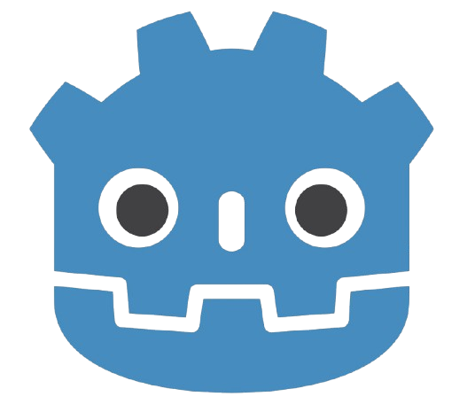
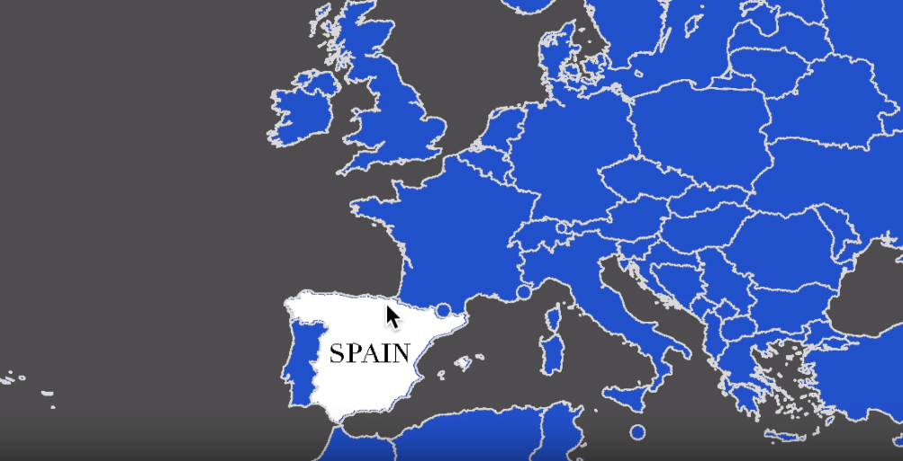
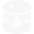
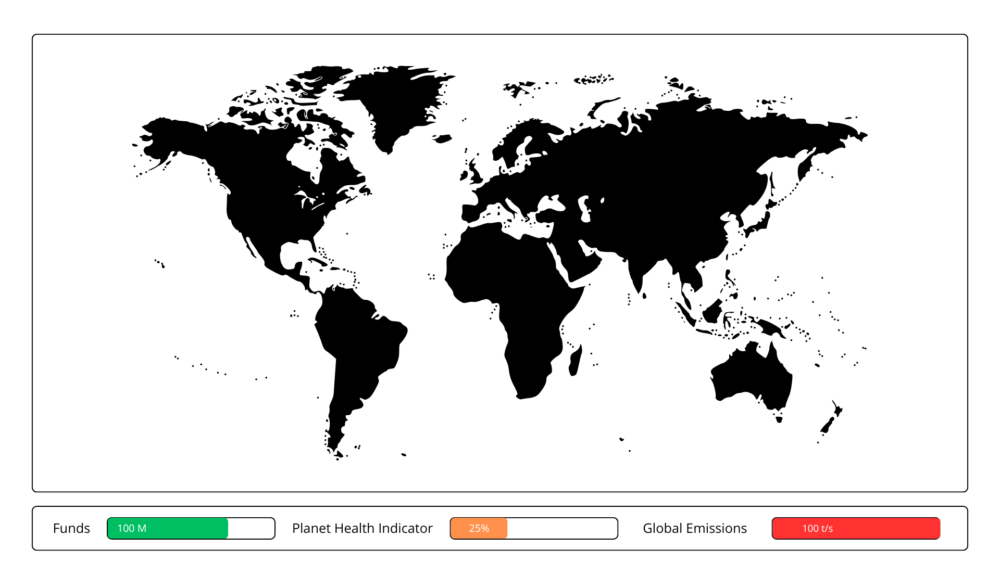
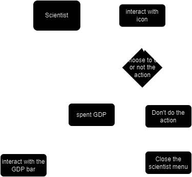
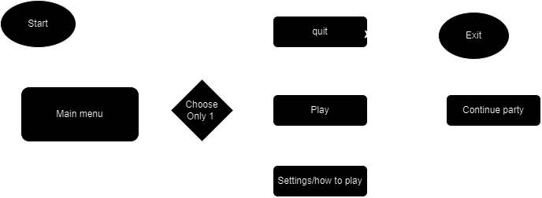

# Technical Specifications : Project serious game
| Engine   | Project       | Year      | School   | Team |
|----------|---------------|-----------|----------|------|
|  | Serious Game | 2024-2025 | Algosup | 2 |

## Last update and review

| Name | Date |
|------|------|
| Bopp Alexandre | 11/29/2024 |
| Polard Vianney | 11/29/2024 |

## Serious Game Using godot engine 


## Introduction to godot 

Godot is a free and open-source game engine that offers a comprehensive set of tools for 2D and 3D game development. It features a unique node-based architecture, a built-in scripting language called GDScript (similar to Python), and support for visual scripting. Godot is known for its lightweight nature, cross-platform compatibility, and active community support, making it an excellent choice for both beginners and experienced developers looking to create games or interactive applications.

## Table of Contents

- [Technical Specifications : Project serious game](#technical-specifications--project-serious-game)
  - [Last update and review](#last-update-and-review)
  - [Serious Game Using godot engine](#serious-game-using-godot-engine)
  - [Introduction to godot](#introduction-to-godot)
  - [Table of Contents](#table-of-contents)
  - [I. The project goal](#i-the-project-goal)
  - [II. The project requirements](#ii-the-project-requirements)
    - [a. Project](#a-project)
    - [b. Project Management](#b-project-management)
      - [1. What is GitHub?](#1-what-is-github)
        - [1.1 **Project Tracking and Documentation**:](#11-project-tracking-and-documentation)
      - [2. What is a Branch in Git?](#2-what-is-a-branch-in-git)
        - [1.1 Git Repository Structure](#11-git-repository-structure)
      - [3. How Does Git Work?](#3-how-does-git-work)
  - [III. Term definitions](#iii-term-definitions)
  - [IV. Godot Utilization \& Code Architecture](#iv-godot-utilization--code-architecture)
    - [a. Key Points to Remember:](#a-key-points-to-remember)
    - [b. Godot Tree Structure:](#b-godot-tree-structure)
    - [c. Godot system requirements](#c-godot-system-requirements)
  - [V. Project Naming Conventions \& comments](#v-project-naming-conventions--comments)
    - [a.Naming conventions](#anaming-conventions)
      - [1. What is **snake\_case**?](#1-what-is-snake_case)
      - [2. WHat is **didot**?](#2-what-is-didot)
    - [b. Comments](#b-comments)
      - [1. How to write comments in Godot ?](#1-how-to-write-comments-in-godot-)
      - [2. Commenting in our project ?](#2-commenting-in-our-project-)
  - [VI. Map and code logic](#vi-map-and-code-logic)
    - [a. Map](#a-map)
    - [b. Color States](#b-color-states)
      - [1. Pseudo-code example: Color State](#1-pseudo-code-example-color-state)
    - [c. Pin and Icons System](#c-pin-and-icons-system)
      - [1. Pin Rendering System](#1-pin-rendering-system)
      - [2. Technical Details](#2-technical-details)
        - [1.1 Code example: Pin Rendering](#11-code-example-pin-rendering)
      - [3. Pin-Icon Integration Process](#3-pin-icon-integration-process)
      - [4. Example Table for Icons and Pins](#4-example-table-for-icons-and-pins)
  - [VII. Game play mechanics](#vii-game-play-mechanics)
    - [a. Mouse](#a-mouse)
      - [1. Pseudo-code example :](#1-pseudo-code-example-)
    - [b. Progress Bars](#b-progress-bars)
      - [1. GDP progress bar](#1-gdp-progress-bar)
        - [1.1 Time Management:](#11-time-management)
        - [1.2 Pseudo-code example: GDP bar](#12-pseudo-code-example-gdp-bar)
      - [2. CO2 progress bar](#2-co2-progress-bar)
        - [1. Pseudo-code example: CO2 bar](#1-pseudo-code-example-co2-bar)
        - [1.1. Key Objective:](#11-key-objective)
        - [1.2 Integration Between CO2 and Planet Health Bars](#12-integration-between-co2-and-planet-health-bars)
        - [1.3 Example Calculation](#13-example-calculation)
      - [3. Planet Health Progress Bar](#3-planet-health-progress-bar)
        - [1.1 Pseudo-code example: Health bar](#11-pseudo-code-example-health-bar)
      - [4. Example Progress Bar](#4-example-progress-bar)
    - [c. Scientist](#c-scientist)
      - [1. R\&D Bar Logic](#1-rd-bar-logic)
      - [2. Pseudo-code example : R\&D](#2-pseudo-code-example--rd)
      - [3. R\&D Behavior](#3-rd-behavior)
      - [4. Integration with Game Systems](#4-integration-with-game-systems)
      - [5. Pseudo-code explanation: Upgrade](#5-pseudo-code-explanation-upgrade)
      - [6. Integration UI](#6-integration-ui)
  - [VIII. Data Management \& Storage](#xiii-data-management--storage)
    - [a. Code Example for Country Data](#a-code-example-for-country-data)
    - [b. Why Use Dictionaries within Dictionaries? ?](#b-why-use-dictionaries-within-dictionaries-)
    - [c. Updates the storage](#c-updates-the-storage)
  - [IX. Project Launch](#ix-project-launch)
    - [a. Main Menu System](#a-main-menu-system)
    - [b. Pseudo-code example: Menu Button Handling](#b-pseudo-code-example-menu-button-handling)


## I. The project goal 

This technical architecture and implementation plan is for our Interactive World Map Game, a serious game designed to educate players on the interplay between economics, environmental factors, and sustainable practices. The project is developed using Godot Engine (v4.3), design to facilitate expansion and adaptability. The game combines an interactive global map with dynamic systems such as GDP progression, CO2 tracking, and actionable interventions by the player.

## II. The project requirements 

### a. Project

| **Topic**                | **Requirements**                                                                                                          |
|--------------------------|---------------------------------------------------------------------------------------------------------------------------|
| **Engine**               | Use the GODOT 4.3 engine for game development. (not mandatory)                                                                           |
| **Game Type**            | Design and produce a serious game focused on **Climate Change**.                                                          |
| **Game Design**          | Follow standard game design and development principles to ensure a polished product.                                      |
| **Scope**                | Create a **small but polished** game that meets high standards of design and functionality.                               |
| **Testing**              | Conduct continuous testing throughout the development process to ensure quality.                                          |
| **Final Deliverable**    | The game should be engaging, bug-free, and feature-complete to the extent possible.                                       |
| **Game Theme**           | Climate Change is the main theme; the game should educate players on environmental impact and responsible actions.        |
| **Sub-Theme Options**    | Choose a specific climate-related topic (e.g., nuclear power, rising temperatures, mobility options, wildfires, etc).     |
| **Genre Flexibility**    | Each team may choose the game sub-genre (e.g., strategy, card game, trivia, platformer, etc.).                            |
| **Music**                | Use free sound assets or create original music for the game.                                                          |    

### b. Project Management

For effective project versioning and management, it is essential to use **GitHub**, a robust version control platform that facilitates collaboration and project tracking.

#### 1. What is GitHub?

**GitHub** is a powerful, web-based platform built around **Git**, a version control system that allows multiple contributors to track, manage, and collaborate on code and other project files seamlessly. Using GitHub for this project offers multiple advantages:

##### 1.1 **Project Tracking and Documentation**: 
GitHub allows teachers and team members to view, comment on, and review project progress in real-time. This level of visibility helps ensure that each member's contributions are tracked accurately, and issues can be flagged and addressed efficiently.

1. **Version Control and Recovery**: GitHub’s version control capabilities mean that every change made is saved as a snapshot, or “commit.” This allows us to easily track the evolution of the project over time. If files or code are deleted or corrupted, previous versions can be retrieved and restored effortlessly.

2. **Collaboration**: GitHub makes collaborative work more effective by providing tools for code merging, branching, and pull requests. Team members can work on their own sections of the project without disrupting each other’s work, then merge contributions as they are completed and approved.

3. **Project Organization**: GitHub also offers options for issue tracking, milestones, and project boards, which allow for detailed tracking of tasks, bugs, and features. This is essential for managing the scope and priorities of the project.

#### 2. What is a Branch in Git?

A **branch** in Git is a separate line of development that allows team members to work on different features, fixes, or tasks independently. Branches enable us to work efficiently and remain organized by isolating changes until they are ready to be integrated into the main project. For example, each new feature or bug fix can have its own branch, so work can be completed, tested, and reviewed independently before merging.

##### 1.1 Git Repository Structure

```
Main
├── documents
├── src
└── Readme.md
dev
├── src
├── .DS_Store
└── Readme.md
Documents_tech
├── Technicalspecification.md
├── images/
├── .DS_Store
├── .gitignore
└── Readme.md
Documents_funct
├── functionnal.md
├── images/
├── .DS_Store
├── .gitignore
└── Readme.md
Documents_quality_insurance
├── documents
└── Readme.md
```

#### 3. How Does Git Work?

Git provides several commands to manage branches and perform essential tasks. Below is a list of the primary Git commands used in this project:

| Command                 | Description                                         |
|-------------------------|-----------------------------------------------------|
| `git init`              | Initializes a local Git repository.                 |
| `git clone <url>`       | Creates a local copy of a remote repository.        |
| `git branch <name>`     | Creates a new branch.                               |
| `git checkout <branch>` | Switches to a specified branch.                     |
| `git add <file>`        | Adds a file to the staging area.                    |
| `git commit -m "message"` | Commits changes with a message.                 |
| `git push`              | Pushes a branch to the remote repository.           |
| `git pull`              | Updates the local repository to the latest commit.  |
| `git merge <branch>`    | Merges a specified branch into the active branch.   |
| `git status`            | Checks the status of the working directory.         |
| `git log`               | Displays the commit history.                        |


Using these commands effectively allows us to maintain a clean and organized codebase, collaborate smoothly, and minimize conflicts or disruptions during development.


## III. Term definitions 

| **Term**                  | **Definition**                                                                                                           |
|---------------------------|--------------------------------------------------------------------------------------------------------------------------|
| **2D**                    | Refers to a two-dimensional plane where objects and environments are represented using height and width only.            |
| **Node**                  | A fundamental element in Godot that acts as a building block for creating scenes. Each node has its own properties and can be used for different purposes, like physics, visuals, or scripting. |
| **Scene**                 | A collection of nodes organized in a tree structure. Scenes are modular components in Godot and can be reused, combined, and instanced within other scenes. |
| **Instance**              | A reusable copy of a scene or node that can be added to other scenes, allowing for modular and efficient game design.    |
| **Global State**          | A game-wide variable or singleton used to store data or controls that must persist and be accessible across different scenes. |
| **Resource**              | Assets and data in Godot, such as textures, sounds, and scripts, which can be imported and used throughout the project.   |
| **Inspector**             | A Godot panel that allows developers to view and adjust the properties of selected nodes and resources in the editor.     |
| **Script**                | A code file attached to nodes to define custom behavior, often written in Godot's GDScript or other compatible languages like C#. |
| **GDScript**              | Godot's integrated scripting language, designed to be optimized and user-friendly for game development within the Godot engine. |
| **Script Lifecycle**      | The set of functions like `_ready()`, `_process()`, and `_physics_process()` that dictate a script's behavior during each game loop. |
| **Signal**                | A messaging system in Godot used to send notifications between nodes, allowing for decoupling and modular communication within the scene. |
| **Physics Body**          | Nodes such as `KinematicBody2D`, `RigidBody2D`, or `StaticBody2D` used for handling physics interactions and collisions in the 2D game world. |
| **Collision Shape**       | A node defining the shape for collision detection on physics bodies, determining how they interact with other objects in the 2D game. |
| **Canvas Layer**          | A Godot node used for positioning elements in 2D space, such as user interfaces or HUDs, that are unaffected by the main camera's movement. |
| **UI (User Interface)**   | Elements like buttons, labels, and progress bars that allow the player to interact with the game; typically managed by CanvasLayer nodes. |
| **Animation Player**      | A node used to create and manage complex animations by animating properties of nodes over time in 2D.                    |
| **Delta Time**            | The time elapsed between frames, used in functions like `_process(delta)` to ensure smooth and frame-rate independent movement in 2D. |
| **Frame Rate**            | The frequency at which frames are rendered per second, affecting the smoothness of animations and gameplay experience in 2D.    |


## IV. Godot Utilization & Code Architecture

Godot provides a wide range of built-in templates and nodes that can be easily customized for your game. You can drag and drop nodes to create complex scenes and behaviors quickly. The engine also includes a scripting section where you can write custom code to handle game logic, such as player movement, interactions, or AI behaviors.

### a. Key Points to Remember:

- **Node Structure**: Carefully check each node connection. Proper node hierarchy and links are crucial for your game to function as intended in Godot.
- **Signals**: Use signals to manage and track specific events in your game (e.g., player interactions, collisions, or triggering animations).
- **Scene Management**: Once you've set up a scene with nodes and scripts, save it and then drag it into your main game scene to integrate it with the overall gameplay.

### b. Godot Tree Structure:

In Godot, your project scene will typically consist of multiple nodes organized hierarchically. Here's our example of a basic scene tree might look like:

```
res://
├── addons     # Folder reserved for plugins and custom modules that extend the functionality of the Godot engine.
├── assets     # Folder for storing various assets such as images, models, textures, and other reusable resources.
|  ├── sounds  # Used for sound effects, music, and other audio assets, keeping audio files organized.
|  ├── fonts   # Designated for font files used in the game, making it easy to manage typography across UI components.
├── scenes     # Contains the main scenes of the game; each scene represents a specific game object.
├── scripts    # Holds GDScript files used to add functionality to nodes within scenes, separating logic from resources.
├── ui         # Contains user interface elements like button images, icons, and other UI assets.
└── icon.svg   # The project icon, often the Godot logo or a custom icon representing the project.
```

### c. Godot system requirements

We are using Godot on our school's laptops, and it's important to know the minimum system requirements for the engine to run smoothly. Although it can also be used on phones, we are not using it for mobile development.

<details>
  <summary>Minimum configuration for usage</summary>

  <table>
    <thead>
      <tr>
        <th><strong>Desktop or Laptop PC</strong></th>
        <th><strong>Minimum Requirements</strong></th>
      </tr>
    </thead>
    <tbody>
      <tr>
        <td><strong>CPU</strong></td>
        <td>
          <ul>
            <li><strong>Windows</strong>: x86_32 CPU with SSE2 instructions, or any x86_64 CPU<br>Example: Intel Core 2 Duo E8200, AMD Athlon XE BE-2300</li>
            <li><strong>macOS</strong>: x86_64 or ARM CPU (Apple Silicon)<br>Example: Intel Core 2 Duo SU9400, Apple M1</li>
            <li><strong>Linux</strong>: x86_32 CPU with SSE2 instructions, x86_64 CPU, ARMv7 or ARMv8<br>Example: Intel Core 2 Duo E8200, AMD Athlon XE BE-2300, Raspberry Pi 4</li>
          </ul>
        </td>
      </tr>
      <tr>
        <td><strong>GPU</strong></td>
        <td>
          <ul>
            <li><strong>Forward+ Rendering Method</strong>: Integrated graphics with Vulkan 1.0 support<br>Example: Intel HD Graphics 5500 (Broadwell), AMD Radeon R5 Graphics (Kaveri)</li>
            <li><strong>Mobile Rendering Method</strong>: Integrated graphics with full Vulkan 1.0 support<br>Example: Intel HD Graphics 5500 (Broadwell), AMD Radeon R5 Graphics (Kaveri)</li>
            <li><strong>Compatibility Rendering Method</strong>: Integrated graphics with OpenGL 3.3 support<br>Example: Intel HD Graphics 2500 (Ivy Bridge), AMD Radeon R5 Graphics (Kaveri)</li>
          </ul>
        </td>
      </tr>
      <tr>
        <td><strong>RAM</strong></td>
        <td>
          <ul>
            <li>Native editor: 4 GB</li>
            <li>Web editor: 8 GB</li>
          </ul>
        </td>
      </tr>
      <tr>
        <td><strong>Storage</strong></td>
        <td>
          <ul>
            <li>200 MB (used for executable, project files, and cache)</li>
            <li>Exporting projects requires separate download of export templates (1.3 GB after installation)</li>
          </ul>
        </td>
      </tr>
      <tr>
        <td><strong>Operating System</strong></td>
        <td>
          <ul>
            <li><strong>Native editor</strong>: Windows 7, macOS 10.13 (Compatibility) or macOS 10.15 (Forward+/Mobile), Linux distribution from 2016 or later</li>
            <li><strong>Web editor</strong>: Firefox 79, Chrome 68, Edge 79, Safari 15.2, Opera 64</li>
          </ul>
        </td>
      </tr>
    </tbody>
  </table>

</details>


<details>
  <summary>Minimum configuration for the export</summary>

  <table>
    <thead>
      <tr>
        <th><strong>Desktop or Laptop PC</strong></th>
        <th><strong>Minimum Requirements</strong></th>
      </tr>
    </thead>
    <tbody>
      <tr>
        <td><strong>CPU</strong></td>
        <td>
          <ul>
            <li><strong>Windows</strong>: x86_32 CPU with SSE2 instructions, or any x86_64 CPU<br>Example: Intel Core 2 Duo E8200, AMD Athlon XE BE-2300</li>
            <li><strong>macOS</strong>: x86_64 or ARM CPU (Apple Silicon)<br>Example: Intel Core 2 Duo SU9400, Apple M1</li>
            <li><strong>Linux</strong>: x86_32 CPU with SSE2 instructions, x86_64 CPU, ARMv7 or ARMv8 CPU<br>Example: Intel Core 2 Duo E8200, AMD Athlon XE BE-2300, Raspberry Pi 4</li>
          </ul>
        </td>
      </tr>
      <tr>
        <td><strong>GPU</strong></td>
        <td>
          <ul>
            <li><strong>Forward+ Rendering Method</strong>: Integrated graphics with Vulkan 1.0 support<br>Example: Intel HD Graphics 5500 (Broadwell), AMD Radeon R5 Graphics (Kaveri)</li>
            <li><strong>Mobile Rendering Method</strong>: Integrated graphics with full Vulkan 1.0 support<br>Example: Intel HD Graphics 5500 (Broadwell), AMD Radeon R5 Graphics (Kaveri)</li>
            <li><strong>Compatibility Rendering Method</strong>: Integrated graphics with OpenGL 3.3 support<br>Example: Intel HD Graphics 2500 (Ivy Bridge), AMD Radeon R5 Graphics (Kaveri)</li>
          </ul>
        </td>
      </tr>
      <tr>
        <td><strong>RAM</strong></td>
        <td>
          <ul>
            <li>For native exports: 2 GB</li>
            <li>For web exports: 4 GB</li>
          </ul>
        </td>
      </tr>
      <tr>
        <td><strong>Storage</strong></td>
        <td>
          <ul>
            <li>150 MB (used for executable, project files, and cache)</li>
          </ul>
        </td>
      </tr>
      <tr>
        <td><strong>Operating System</strong></td>
        <td>
          <ul>
            <li><strong>For native exports</strong>: Windows 7, macOS 10.13 (Compatibility) or macOS 10.15 (Forward+/Mobile), Linux distribution from 2016 or later</li>
            <li><strong>For web exports</strong>: Firefox 79, Chrome 68, Edge 79, Safari 15.2, Opera 64</li>
          </ul>
        </td>
      </tr>
    </tbody>
  </table>
</details>

## V. Project Naming Conventions & comments

### a.Naming conventions

In this project, we will follow the **snake_case** naming convention for all assets, scripts, and identifiers. And for all the elements inside the game we are using the **didot** fonts.

#### 1. What is **snake_case**?

**snake_case** is a naming convention where all letters are lowercase, and words are separated by underscores (`_`). This makes the names more readable and consistent, especially in file systems and programming languages that do not allow spaces in identifiers.

| Convention | Examples |
|------------|----------|
| **snake_case** | `game_scene.tscn`, `update_score()` |

#### 2. WHat is **didot**?

Didot is a serif font family characterized by its high contrast between thick and thin strokes, vertical stress, and elegant appearance. Originating from 18th-century France, it is often associated with luxury, refinement, and professionalism.

<a href="https://www.dafontfree.io/didot-font-free/" style="display: inline-block; font-size: 16px; color: white;  text-decoration: none; border-radius: 5px;">Click here</a>

### b. Comments

In every project, it is essential for developers to comment their code to make it more understandable for others, or even for themselves when revisiting the project later. Clear and concise comments can save time and effort by explaining the purpose and functionality of specific parts of the code.

#### 1. How to write comments in Godot ?

In Godot, comments are written using specific symbols to ensure they are ignored by the engine during execution. Here's an example:

| Symbol | Examples |
|--------|----------|
| **#** | # This statement calls a function to count the elapsed time |

#### 2. Commenting in our project ?

We adopted a clear and minimalistic commenting approach.

<ul>
  <li>Focus on clarity</li>
  <li>Avoid trivial lines</li>
  <li>Simplification through text</li>
</ul>


## VI. Map and code logic

Our map is a 2D planisphere, providing a top-down view of the entire European continent. You can click on a specific area, and the map will zoom in on the selected country. Additionally, by hovering over a country, you can see its name, and its color will change accordingly.

### a. Map 

 

</br>

**Selection**: View the full map and click on a country to switch in (change gd scene). Use the mouse to zoom out.

**Country Details**: Switching in reveals tasks with colors indicating ecological states.

**Data Storage**: Each country's details, like name and ecological state, are stored in a dictionary.

**Info Display**: Labels show key information (name, ecological state) for the selected country.

### b. Color States

To enhance visual clarity and support immersive gameplay, we have set up a color system with five distinct colors. Each color represents the ecological status of a zone and indicates the urgency of any required player actions.

| **Color** | **State Description** |
|-----------|------------------------|
|  **Green**   | Optimal: The zone is fully optimized for climate impact, and no further improvements can be made. |
|  **Yellow**  | Moderate: Improvements are recommended, although the current state poses minimal risk to the environment. |
|  **Orange**  | Average: The zone is balanced between positive and negative impacts. Adjustments are advisable, though not immediately critical. |
|  **Red**     | Critical: The zone is in a damaging state. Player intervention is required to prevent further environmental degradation. |
|  **Black**   | Disaster: The zone has experienced an ecological disaster, significantly impacting the climate. Immediate action is required. |

#### 1. Pseudo-code example: Color State
```
func get_color_state(state: String) -> Color:
    match state:
        "Green":
            return Color(0, 1, 0)  # Green
        "Yellow":
            return Color(1, 1, 0)  # Yellow
        "Orange":
            return Color(1, 0.5, 0)  # Orange
        "Red":
            return Color(1, 0, 0)  # Red
        "Black":
            return Color(0, 0, 0)  # Black
        _:
            return Color(1, 1, 1)  # Default (White)
```

</br>


Using the left-click, players can allocate GDP(gross domestic product) to upgrade a zone's environmental status. Upgrades are tied to the country’s GDP, and careful consideration is needed to prioritize spending.

There are five types of upgrades, each addressing a specific environmental factor. When selected, an upgrade will consume a portion of GDP and immediately improve the zone’s color status. If a zone moves from **Yellow** to **Green**, for instance, it indicates a successful optimization of environmental impact. Each improvement shifts the color state towards a less critical status, reflecting progress toward ecological sustainability.

### c. Pin and Icons System

This section describes the technical implementation of the map pin rendering system and the integration of icons based on game data.


#### 1. Pin Rendering System
Pins are dynamically generated on the map based on the country selected. Each pin represents a category (e.g., **Metals**, **Crops**, **Car**) and displays the corresponding icon. The color of the pin reflects the ecological **color state**.

| **Functionality**         | **Description**                                                                 |
|---------------------------|---------------------------------------------------------------------------------|
| **Pin Creation**           | Dynamically generates pins based on the selected country's data.               |
| **Assign Icon**            | Pins are assigned an icon corresponding to the category they represent.        |
| **Color State Management** | The pin color updates in real-time to reflect the current ecological state.    |


#### 2. Technical Details

##### 1.1 Code example: Pin Rendering
```
func render_pins(country_data):
    for category in country_data["categories"]:
        var pin = Pin.new()  # Create a new pin instance
        pin.icon = load(category.icon_path)  # Assign the icon based on category
        pin.color = get_color_state(category.state)  # Assign the color state
        pin.position = category.map_position  # Place the pin on the map
        add_child(pin)  # Add the pin to the scene tree
```

#### 3. Pin-Icon Integration Process
| **Step** |	**Description** |
|----------|------------------|
|`Fetch Data`|	Retrieves country-specific data, including categories and their states.|
|`Create Pin` | Instances	Dynamically creates pins for each category using the Pin object.|
|`Load Icons` |	Icons are loaded from file paths defined in the game database.|
|`Assign Color State` |	Pins are updated with colors corresponding to their current ecological states.|
|`Render Pins on Map` | Pins are positioned on the map based on coordinates defined in the game database.|

#### 4. Example Table for Icons and Pins

| **Map Pin Color** | **Icon** |
|-------------------|----------|
|  `Red` |  |
|  `Green` |  |
|  `Orange` |  |


## VII. Game play mechanics

### a. Mouse

In this game, all tasks are controlled using the mouse. The following actions can be performed with different mouse interactions:

| Mouse Action       | Description                                                                                                                                                |
|--------------------|------------------------------------------------------------------------------------------------------------------------------------------------------------|
| **Left Click**     | Main interaction: Used to perform actions such as purchasing, switching into a country, returning to the main menu, configuring settings, and selecting options. |
| **Right Click**    | Undo action: After a left-click, if the action is not completed, the right-click allows you to return to the previous state or cancel the action.            |
| **Mouse Wheel**    | Zoom out: Used to dezoom and view the entire map, allowing you to navigate between different countries and regions.                                          |

#### 1. Pseudo-code example :

```
Function: _ready()
    - Initialize the node when the game starts

Function: _process(delta)
    - Continuously checks for mouse actions every frame
    - If left mouse button is clicked:
        - Handle the left click action by calling the `handle_left_click()` function
    - If right mouse button is clicked:
        - Handle the right click action by calling the `handle_right_click()` function
    - If the mouse wheel is scrolled:
        - Handle the zooming action by calling the `handle_mouse_wheel()` function

Function: handle_left_click()
    - Get the current position of the mouse on the screen
    - Output the mouse position to the console
    - Perform a specific action based on the mouse click (e.g., zooming, selecting a country)

Function: handle_right_click()
    - Get the current position of the mouse on the screen
    - Output the mouse position to the console
    - Undo the last action performed, or cancel the current action

Function: handle_mouse_wheel()
    - Detect the mouse wheel scroll (down)
    - Zoom out of the country
    - If scrolling down: Zoom out (view the entire map)
```

### b. Progress Bars

#### 1. GDP progress bar

In the game, **GDP (Gross Domestic Product)** represents the in-game currency. Each country has a progress bar that reflects its current GDP, which is automatically managed by the system. The progress bar fills over time, and as it fills, the player can use the GDP to purchase improvements for the country. However, each purchase is costly, and you must wait for the bar to fill before making additional purchases.

##### 1.1 Time Management:
The progress bar is based on the real **GDP** of the country. The rate at which it fills is influenced by the actions taken by the player. Actions that positively impact the country’s economy will increase the rate of progress, while negative actions may slow it down or even decrease the bar's value.

- The progress bar automatically updates in real-time, reflecting the country's economic changes based on the player's decisions.
- The rate of increase or decrease in the progress bar depends on the actions performed, influencing the country’s economic growth or decline.

##### 1.2 Pseudo-code example: GDP bar

```
# Initialize GDP settings
MAX_GDP = 100               # Maximum GDP level
current_GDP = 0             # Current GDP level
fill_rate_per_second = 5    # Rate at which GDP fills in real-time (units per second)
purchase_cost = 50          # Cost of an improvement purchase
last_update_time = 0        # Timestamp of the last GDP update

# Reference to the GDP progress bar UI element
GDP_bar = ProgressBar        # Progress bar element on the UI

# Initialize the GDP system
function _ready():
    # Set up the GDP progress bar
    GDP_bar.max_value = MAX_GDP
    GDP_bar.value = current_GDP
    last_update_time = current_time_in_seconds()  # Get the current time in seconds

# Update GDP in real-time
function _process(delta):
    current_time = current_time_in_seconds()  # Get the current time in seconds
    elapsed_time = current_time - last_update_time

    if current_GDP < MAX_GDP:
        # Increase GDP based on the elapsed time since last update
        current_GDP += fill_rate_per_second * elapsed_time
        current_GDP = minimum_value(current_GDP, MAX_GDP)  # Ensure GDP does not exceed MAX_GDP
        GDP_bar.value = current_GDP  # Update the progress bar with the new GDP value

    last_update_time = current_time  # Update the timestamp of the last GDP update

# Handle purchasing an improvement
function make_purchase():
    if current_GDP >= purchase_cost:
        current_GDP -= purchase_cost  # Deduct the purchase cost from GDP
        GDP_bar.value = current_GDP   # Update the progress bar after the purchase
        print("Purchase successful! Remaining GDP:", current_GDP)
    else:
        print("Insufficient GDP for purchase.")


```

#### 2. CO2 progress bar

A simple calculation is performed based on the actions taken by the player. Each action will either positively or negatively impact the **Health planet** progress bar. If the management of the country deteriorates significantly, the progress bar will fill.

##### 1. Pseudo-code example: CO2 bar

```
# Define maximum and initial CO2 levels for a country
SET max_co2 TO 100  # Maximum CO2 level
SET current_co2 TO 50  # Initial CO2 level

# Define actions and their impact on CO2 levels
SET action_impact TO {
    "build_industry": +15,  # Increases CO2
    "green_energy": -10,  # Decreases CO2
    "enforce_policy": -5  # Decreases CO2
}

# Initialize the CO2 progress bar
FUNCTION initialize_co2_bar():
    SET progress_bar_max_value TO max_co2
    SET progress_bar_current_value TO current_co2

# Function to apply an action and adjust the CO2 level
FUNCTION apply_action(action_name):
    IF action_name EXISTS IN action_impact:
        INCREMENT current_co2 BY action_impact[action_name]  # Adjust CO2 level
        CLAMP current_co2 TO A RANGE OF (0 TO max_co2)  # Keep CO2 within limits
        UPDATE progress_bar_current_value TO current_co2  # Reflect change on bar
    ELSE:
        PRINT "Invalid action:", action_name

```

##### 1.1. Key Objective:

The primary goal is to **reduce the progress bar** across all playable countries. The lower the progress bar, the better the economic and environmental management of the country. This mechanic encourages players to make decisions that optimize their country’s economy while avoiding disastrous consequences for humanity.

#####  1.2 Integration Between CO2 and Planet Health Bars

The CO2 Progress Bar for each country is directly tied to the Planet Health Bar. As CO2 levels increase globally, the Planet Health Bar rises proportionally. Conversely, reducing CO2 in multiple countries improves the Planet Health Bar.

##### 1.3 Example Calculation

| Country   | CO2 Level | Contribution             |
|-----------|-----------|--------------------------|
| France    | 55        | \( 55 \ 0.1 = 5.5 \) |
| Germany   | 75        | \( 75 \ 0.1 = 7.5 \) |

Initial Planet Health: 20

Calculation:
planet_health = 20+(5.5+7.5)= 33

#### 3. Planet Health Progress Bar

The Planet Health Progress Bar represents the overall health of the planet, calculated based on the combined CO2 levels of all countries. This bar is visible only when viewing the entire map, providing a global perspective on the environmental situation.

##### 1.1 Pseudo-code example: Health bar

```
FUNCTION Update Planet Health Bar():
    total_co2 = 0  # Initialize total CO2 level to 0
    
    FOR each country IN all countries:
        total_co2 += country.CO2  # Add each country's CO2 level to the total
    
    planet_health_percentage = total_co2 / max_possible_co2  # Calculate the percentage of planet's health
    
    UPDATE Planet Health Progress Bar value TO planet_health_percentage
    IF planet_health_percentage >= 1.0:
        TRIGGER global disaster  # If the health reaches 100%, initiate the global disaster

```

#### 4. Example Progress Bar

The progress bar is located in the top corner of the screen, providing a clear visual representation of the game's key characteristics and primary objectives. This bar displays important metrics, including the **GDP** and **CO2** levels, helping players track their progress and make informed decisions throughout the game.



### c. Scientist

**Scientist Icon**:


**Purpose**: Allows players to invest in R&D actions, which increase the R&D Bar for the currently selected country.
**Default** Behavior: The R&D Bar starts at 0 and progresses based on the number and cost of actions taken.


#### 1. R&D Bar Logic

The **R&D** Bar reflects the progress of research and development efforts in a specific country. The more players invest in actions through the Scientist, the faster the bar progresses. The bar is proportional to the cost and number of actions performed.

#### 2. Pseudo-code example : R&D

```
# Initialize the R&D Bar and load available actions
FUNCTION Ready:
    Set R&D Bar value to 0  # Start the progress bar at zero
    Populate the menu with actions  # Load all actions from the knowledge database

# Populate the menu with buttons for each R&D action
FUNCTION Populate Menu:
    Retrieve actions from the knowledge database
    FOR each action IN actions:
        Create a new button
        Set button text to "Action Name (Cost: Action Cost)"
        Connect the button's pressed event to the "Action Selected" function
        Add the button to the menu's container (e.g., VBoxContainer)

# Handle selection of an R&D action
FUNCTION Action Selected(action):
    IF the player's GDP is greater than or equal to the action's cost:
        Deduct the action cost from the player's GDP
        Increase the R&D Bar progress based on the action
    ELSE:
        Print "Not enough GDP to perform this action"

# Increase the R&D Bar progress
FUNCTION Increase R&D Progress(action):
    Add the action's cost to the R&D Bar value
    Clamp the R&D Bar value between 0 and the maximum value (to avoid overflow)
    Print "Action applied: Action Name - R&D progress increased"

```

#### 3. R&D Behavior

**Default State**:
The R&D Bar starts at 0 when entering a country scene.
The bar is updated dynamically as the player takes actions through the Scientist menu.

**Action Example**:
Action: "Develop Solar Energy" (Cost: 100)
Cost deducted: 100 GDP
R&D bar increases proportionally: bar.value += 100.
Maximum R&D Progress:

If the R&D Bar reaches its maximum value, additional actions will not increase the bar further.
Players must strategize how to use their GDP efficiently to optimize the bar progression.


#### 4. Integration with Game Systems

The Scientist Icon connects to other core systems, such as GDP management and environmental metrics:

For the GDP, each upgrade deducts GDP, managed through the global variable Global.gdp.
Environmental Impact: Upgrades modify environmental statistics, implemented via global state updates.
Game Events: Certain upgrades trigger events or unlock features in the game world.
Example: Linking Upgrades to Metrics

<details>
<summary>Click to view diagram</summary>
</br>



</details>

#### 5. Pseudo-code explanation: Upgrade

```
FUNCTION Apply Upgrade(upgrade):
    MATCH upgrade.name:
        CASE "Sustainable Building":
            Reduce global CO2 emissions by 5
        CASE "Clean Energy Policy":
            Increase global GDP by 10
        CASE "Advanced Recycling":
            Reduce global waste impact by 10
        DEFAULT:
            Print "Upgrade not recognized"

```


#### 6. Integration UI

Below is how the Scientist Icon appears within the game's broader UI:

```
MainUI/
├── Map/
├── CO2Bar/
├── GDPBar/
├── R&DBar/
└── ScientistIcon/
    ├── TextureButton
    └── ScientistMenu/
```

## VIII. Data Management & Storage

The KnowledgeDatabase.gd script contains structured data for all available upgrades and solutions.

### a. Code Example for Country Data

```
var countries = {
    "France": {
        "GDP": 3000,
        "CO2": 200,
        "ecological_state": "Green",
        "tasks": [
            {"name": "Improve Recycling", "cost": 50},
            {"name": "Adopt Clean Energy", "cost": 100}
        ]
    },
    "Germany": {
        "GDP": 4000,
        "CO2": 250,
        "ecological_state": "Yellow",
        "tasks": [
            {"name": "Reduce Car Emissions", "cost": 75},
            {"name": "Sustainable Agriculture", "cost": 125}
        ]
    }
}
```

### b. Why Use Dictionaries within Dictionaries? ?

<ul>
  <li>Efficient Lookups: A dictionary allows for fast access to specific data by a unique key ("France"). This eliminates the need to iterate through a list to find a specific country.</li>
  <li>Logical Grouping: Each country acts as a key in the outer dictionary, grouping all its associated data (GDP, CO2, ecological state, tasks) in a single, easy-to-manage structure.</li>
  <li>Scalability: Adding or modifying data for a specific country becomes straightforward.</li>
</ul>

### c. Updates the storage
```

var upgrades = {
    "Sustainable Building": {"cost": 100, "effect": "Reduce CO2 by 5%"},
    "Clean Energy Policy": {"cost": 150, "effect": "Increase GDP by 10%"},
    "Advanced Recycling": {"cost": 200, "effect": "Reduce Waste Impact by 10%"}
}

func get_upgrades():
    return upgrades

```

## IX. Project Launch

When you start the game, the following flow is initiated to guide you through the main menu and the game’s interactive elements:

### a. Main Menu System

The Main Menu system is composed of several scenes and scripts in Godot, organized as follows:

```
MainMenu/
├── MainMenu.tscn       # The main menu scene
├── MainMenu.gd         # Script controlling menu behavior
├── SettingsMenu.tscn   # The settings submenu
├── SettingsMenu.gd     # Script for settings logic
└── SaveSystem.gd       # Script managing saved game data
```

Scene Loading: The Main Menu is the first scene loaded by the game.
Menu Options: Buttons within the MainMenu.tscn are connected to corresponding functions in the MainMenu.gd script.

### b. Pseudo-code example: Menu Button Handling

```
extends Control

Function: _on_resume_pressed()
    If there is a saved game:
        - Load the saved game data
        - Change the scene to the GameWorld scene
    Else:
        - Print a message saying "No saved game found!"

Function: _on_new_game_pressed()
    - Clear any existing saved data
    - Change the scene to the GameWorld scene to start a new game

Function: _on_settings_pressed()
    - Change the scene to the SettingsMenu scene

Function: _on_exit_pressed()
    - Quit the game

```

<details>
<summary>Click to view diagram</summary>
</br>



</details>

